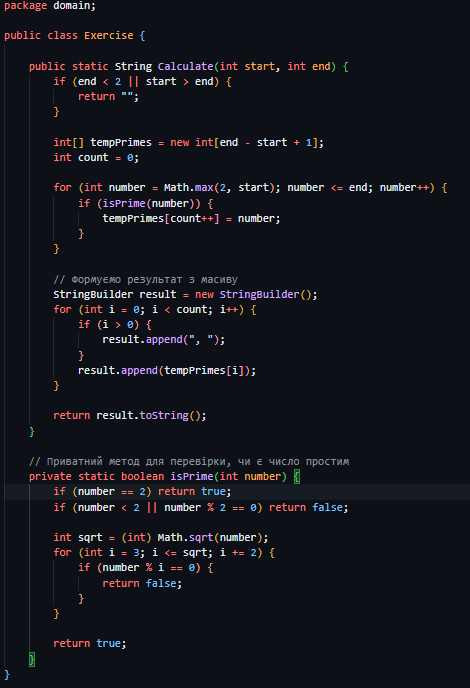
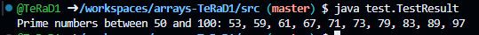

# Практична робота "Масиви, вирази, керування виконанням програми"

## Обране завдання
- Заповніть масив простими числами з вказаного діапазону і виведіть його у вигляді рядка.

## Код Exercise

## Результат
